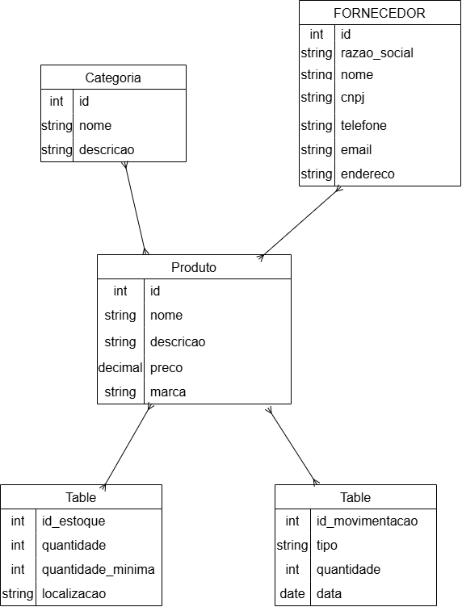
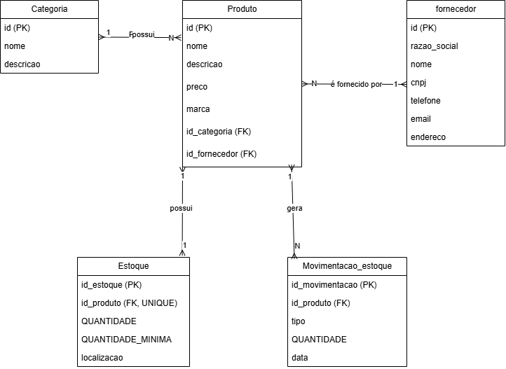

# Estoque de uma Loja

## Descrição

Este projeto apresenta um banco de dados para o gerenciamento do estoque de uma loja de roupas.

O sistema permite controlar produtos, categorias, fornecedores, estoque e movimentações de entrada e saída de produtos.

---

## MER DER Conceitual



---

## MER DER Lógico



---

# Dicionário de Dados

## Categoria

| Campo | Tipo | Descrição |
|---|---|---|
| id | INT | Identificador da categoria |
| nome | VARCHAR | Nome da categoria |
| descricao | VARCHAR | Descrição da categoria |

## Produto

| Campo | Tipo | Descrição |
|---|---|---|
| id | INT | Identificador do produto |
| nome | VARCHAR | Nome do produto |
| descricao | VARCHAR | Descrição do produto |
| preco | DECIMAL | Preço do produto |
| marca | VARCHAR | Marca do produto |
| id_categoria | INT | Identificador da categoria |
| id_fornecedor | INT | Identificador do fornecedor |

## Fornecedor

| Campo | Tipo | Descrição |
|---|---|---|
| id | INT | Identificador do fornecedor |
| razao_social | VARCHAR | Razão social do fornecedor |
| nome_fantasia | VARCHAR | Nome fantasia do fornecedor |
| cnpj | VARCHAR | CNPJ do fornecedor |
| telefone | VARCHAR | Telefone do fornecedor |
| email | VARCHAR | E-mail do fornecedor |
| endereco | VARCHAR | Endereço do fornecedor |

## Estoque

| Campo | Tipo | Descrição |
|---|---|---|
| id_estoque | INT | Identificador do estoque |
| id_produto | INT | Identificador do produto |
| quantidade | INT | Quantidade disponível |
| quantidade_minima | INT | Quantidade mínima |
| localizacao | VARCHAR | Localização do produto |

## Movimentação de Estoque

| Campo | Tipo | Descrição |
|---|---|---|
| id_movimentacao | INT | Identificador da movimentação |
| id_produto | INT | Identificador do produto |
| tipo | ENUM | Entrada ou Saída |
| quantidade | INT | Quantidade movimentada |
| data | DATE | Data da movimentação |

---

# Arquivos CSV

Os dados de teste estão disponíveis nos seguintes arquivos:

- [Categoria](categoria.CSV)
- [Fornecedor](fornecedor.CSV)
- [Produto](produto.CSV)
- [Estoque](estoque.CSV)
- [Movimentação de Estoque](movimentacao_estoque.CSV)

---

# DDL

O arquivo `ddl.sql` contém os comandos utilizados para criar o banco de dados e suas tabelas.

```sql
CREATE DATABASE estoque_loja;
USE estoque_loja;

CREATE TABLE categoria (
    id INT PRIMARY KEY,
    nome VARCHAR(100) NOT NULL,
    descricao VARCHAR(255)
);

CREATE TABLE fornecedor (
    id INT PRIMARY KEY,
    razao_social VARCHAR(150) NOT NULL,
    nome_fantasia VARCHAR(100) NOT NULL,
    cnpj VARCHAR(18) NOT NULL UNIQUE,
    telefone VARCHAR(20),
    email VARCHAR(150),
    endereco VARCHAR(255)
);

CREATE TABLE produto (
    id INT PRIMARY KEY,
    nome VARCHAR(100) NOT NULL,
    descricao VARCHAR(255),
    preco DECIMAL(10,2) NOT NULL,
    marca VARCHAR(100),
    id_categoria INT NOT NULL,
    id_fornecedor INT NOT NULL,
    FOREIGN KEY (id_categoria) REFERENCES categoria(id),
    FOREIGN KEY (id_fornecedor) REFERENCES fornecedor(id)
);

CREATE TABLE estoque (
    id_estoque INT PRIMARY KEY,
    id_produto INT NOT NULL UNIQUE,
    quantidade INT NOT NULL,
    quantidade_minima INT NOT NULL,
    localizacao VARCHAR(100),
    FOREIGN KEY (id_produto) REFERENCES produto(id)
);

CREATE TABLE movimentacao_estoque (
    id_movimentacao INT PRIMARY KEY,
    id_produto INT NOT NULL,
    tipo ENUM('Entrada','Saida') NOT NULL,
    quantidade INT NOT NULL,
    data DATE NOT NULL,
    FOREIGN KEY (id_produto) REFERENCES produto(id)
);
