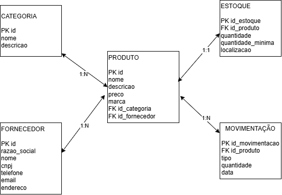

# Estoque de uma Loja

## Descrição

Este projeto apresenta um banco de dados para o gerenciamento do estoque de uma loja de roupas.

O banco de dados permite controlar produtos, categorias, fornecedores, quantidades disponíveis em estoque e movimentações de entrada e saída de produtos.

---

## MER DER Conceitual


---

## MER DER Lógico



---

# Dicionário de Dados

## Categoria

| Campo     | Tipo    | Descrição                  |
| --------- | ------- | -------------------------- |
| id        | INT     | Identificador da categoria |
| nome      | VARCHAR | Nome da categoria          |
| descricao | VARCHAR | Descrição da categoria     |

## Fornecedor

| Campo         | Tipo    | Descrição                   |
| ------------- | ------- | --------------------------- |
| id            | INT     | Identificador do fornecedor |
| razao_social  | VARCHAR | Razão social do fornecedor  |
| nome_fantasia | VARCHAR | Nome fantasia do fornecedor |
| cnpj          | VARCHAR | CNPJ do fornecedor          |
| telefone      | VARCHAR | Telefone do fornecedor      |
| email         | VARCHAR | E-mail do fornecedor        |
| endereco      | VARCHAR | Endereço do fornecedor      |

## Produto

| Campo         | Tipo    | Descrição                   |
| ------------- | ------- | --------------------------- |
| id            | INT     | Identificador do produto    |
| nome          | VARCHAR | Nome do produto             |
| descricao     | VARCHAR | Descrição do produto        |
| preco         | DECIMAL | Preço do produto            |
| marca         | VARCHAR | Marca do produto            |
| id_categoria  | INT     | Identificador da categoria  |
| id_fornecedor | INT     | Identificador do fornecedor |

## Estoque

| Campo             | Tipo    | Descrição                |
| ----------------- | ------- | ------------------------ |
| id_estoque        | INT     | Identificador do estoque |
| id_produto        | INT     | Identificador do produto |
| quantidade        | INT     | Quantidade disponível    |
| quantidade_minima | INT     | Quantidade mínima        |
| localizacao       | VARCHAR | Localização do produto   |

## Movimentação de Estoque

| Campo           | Tipo | Descrição                     |
| --------------- | ---- | ----------------------------- |
| id_movimentacao | INT  | Identificador da movimentação |
| id_produto      | INT  | Identificador do produto      |
| tipo            | ENUM | Entrada ou Saída              |
| quantidade      | INT  | Quantidade movimentada        |
| data            | DATE | Data da movimentação          |

---

# Arquivos CSV

Os dados de teste estão disponíveis nos seguintes arquivos:

* [Categoria](categoria.CSV)
* [Fornecedor](fornecedor.CSV)
* [Produto](produto.CSV)
* [Estoque](estoque.CSV)
* [Movimentação de Estoque](movimentacao_estoque.CSV)

---

# DDL

O DDL é utilizado para criar o banco de dados e suas tabelas.

```sql
CREATE DATABASE estoque_loja;
USE estoque_loja;

CREATE TABLE categoria (
    id INT PRIMARY KEY,
    nome VARCHAR(100) NOT NULL,
    descricao VARCHAR(255)
);

CREATE TABLE fornecedor (
    id INT PRIMARY KEY,
    razao_social VARCHAR(150) NOT NULL,
    nome_fantasia VARCHAR(100) NOT NULL,
    cnpj VARCHAR(18) NOT NULL UNIQUE,
    telefone VARCHAR(20),
    email VARCHAR(150),
    endereco VARCHAR(255)
);

CREATE TABLE produto (
    id INT PRIMARY KEY,
    nome VARCHAR(100) NOT NULL,
    descricao VARCHAR(255),
    preco DECIMAL(10,2) NOT NULL,
    marca VARCHAR(100),
    id_categoria INT NOT NULL,
    id_fornecedor INT NOT NULL,
    FOREIGN KEY (id_categoria) REFERENCES categoria(id),
    FOREIGN KEY (id_fornecedor) REFERENCES fornecedor(id)
);

CREATE TABLE estoque (
    id_estoque INT PRIMARY KEY,
    id_produto INT NOT NULL UNIQUE,
    quantidade INT NOT NULL,
    quantidade_minima INT NOT NULL,
    localizacao VARCHAR(100),
    FOREIGN KEY (id_produto) REFERENCES produto(id)
);

CREATE TABLE movimentacao_estoque (
    id_movimentacao INT PRIMARY KEY,
    id_produto INT NOT NULL,
    tipo ENUM('Entrada','Saida') NOT NULL,
    quantidade INT NOT NULL,
    data DATE NOT NULL,
    FOREIGN KEY (id_produto) REFERENCES produto(id)
);
```

---

# DML

O DML é utilizado para inserir os dados nas tabelas do banco.

```sql
INSERT INTO categoria (id, nome, descricao) VALUES
(1, 'Camisetas', 'Camisetas masculinas e femininas'),
(2, 'Calças', 'Calças jeans e de outros tecidos'),
(3, 'Vestidos', 'Vestidos para diferentes ocasiões'),
(4, 'Jaquetas', 'Jaquetas e casacos');

INSERT INTO fornecedor
(id, razao_social, nome_fantasia, cnpj, telefone, email, endereco)
VALUES
(1, 'Moda Brasil Industria e Comercio LTDA', 'Moda Brasil', '12.345.678/0001-90', '(19) 99999-1001', 'modabrasil@gmail.com', 'Rua do Girassol, 155 - Amparo/SP'),
(2, 'Estilo Fashion Comercio Ltda', 'Estilo Fashion', '23.456.789/0001-01', '(19) 99999-1002', 'estilofashion@gmail.com', 'Av. Central 345 - Pedreira/SP'),
(3, 'Trend Roupas LTDA', 'Trend Roupas', '34.567.890/0001-12', '(19) 99999-1003', 'trendroupas@gmail.com', 'Rua Moderna, 500 - Serra Negra/SP');

INSERT INTO produto
(id, nome, descricao, preco, marca, id_categoria, id_fornecedor)
VALUES
(1, 'Camiseta Basica', 'Camiseta de algodao', 59.90, 'Moda Brasil', 1, 1),
(2, 'Calca Jeans', 'Calca jeans tradicional', 149.90, 'Estilo Fashion', 2, 2),
(3, 'Vestido Floral', 'Vestido estampado floral', 189.90, 'Trend Roupas', 3, 3),
(4, 'Jaqueta Jeans', 'Jaqueta jeans azul', 229.90, 'Moda Brasil', 4, 1),
(5, 'Camiseta Estampada', 'Camiseta com estampa frontal', 79.90, 'Estilo Fashion', 1, 2);

INSERT INTO estoque
(id_estoque, id_produto, quantidade, quantidade_minima, localizacao)
VALUES
(1, 1, 50, 10, 'Prateleira A1'),
(2, 2, 25, 5, 'Prateleira B1'),
(3, 3, 18, 5, 'Prateleira C1'),
(4, 4, 12, 3, 'Prateleira D1'),
(5, 5, 30, 8, 'Prateleira A2');

INSERT INTO movimentacao_estoque
(id_movimentacao, id_produto, tipo, quantidade, data)
VALUES
(1, 1, 'Entrada', 50, '2026-09-01'),
(2, 2, 'Entrada', 30, '2026-09-02'),
(3, 2, 'Saida', 5, '2026-09-10'),
(4, 3, 'Entrada', 20, '2026-09-05'),
(5, 3, 'Saida', 2, '2026-09-12'),
(6, 4, 'Entrada', 15, '2026-09-07'),
(7, 4, 'Saida', 3, '2026-09-15');
```

---

# Organização dos arquivos

```text
sesi_bcd_vps01_estoqueloja_2026
│
├── README.md
├── Estoque loja-conceitual.png
├── estoqueloja-lógico.drawio.png
│
├── categoria.CSV
├── fornecedor.CSV
├── produto.CSV
├── estoque.CSV
├── movimentacao_estoque.CSV
│
├── ddl.sql
└── dml.sql
```

## Tema

**Estoque de uma Loja**
